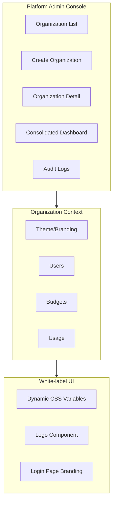

# Organization Layer Implementation Plan

## Overview

Transform StratAI into a true multi-tenant platform with:

1. **Platform Admin Console** - Super admin dashboard to manage all organizations
2. **Organization Onboarding** - Create orgs with seed users and branding
3. **White-label Theming** - Dynamic logo, colors, login branding per organization
4. **Risk Management** - Audit logging, org suspension, data isolation, usage enforcement

## Architecture



---

## Phase 1: Database Schema Extensions

### New/Modified Tables

**1. Extend `organizations` table** ([organizations-schema.sql](stratai-main/src/lib/server/persistence/organizations-schema.sql)):

```sql
ALTER TABLE organizations ADD COLUMN
    -- Branding
    logo_url TEXT,
    primary_color TEXT DEFAULT '#1a6dff',
    secondary_color TEXT DEFAULT '#00dcd5',
    login_background_url TEXT,
    
    -- Status & Risk Management  
    status TEXT DEFAULT 'active' CHECK (status IN ('active', 'suspended', 'trial', 'inactive')),
    suspended_at TIMESTAMPTZ,
    suspended_reason TEXT,
    
    -- Limits
    monthly_budget DECIMAL(10,2),
    max_users INTEGER,
    
    -- Metadata
    billing_email TEXT,
    contact_name TEXT,
    contact_email TEXT;
```

**2. New `audit_logs` table**:

```sql
CREATE TABLE audit_logs (
    id UUID PRIMARY KEY DEFAULT gen_random_uuid(),
    organization_id UUID REFERENCES organizations(id),
    user_id UUID REFERENCES users(id),
    action TEXT NOT NULL,  -- 'org.created', 'user.invited', 'budget.updated', etc.
    entity_type TEXT,      -- 'organization', 'user', 'group', etc.
    entity_id UUID,
    old_values JSONB,
    new_values JSONB,
    ip_address TEXT,
    user_agent TEXT,
    created_at TIMESTAMPTZ DEFAULT NOW()
);
```

**3. Add `platform_role` to users** ([users-schema.sql](stratai-main/src/lib/server/persistence/users-schema.sql)):

```sql
ALTER TABLE users ADD COLUMN 
    platform_role TEXT DEFAULT 'user' CHECK (platform_role IN ('super_admin', 'user'));
```

---

## Phase 2: Platform Admin Routes

### Route Structure

```javascript
/platform-admin/                    # Platform admin root (super_admin only)
├── +layout.server.ts               # Auth guard: super_admin check
├── +layout.svelte                  # Platform admin shell/nav
├── +page.svelte                    # Consolidated dashboard
├── organizations/
│   ├── +page.svelte                # All organizations list
│   ├── new/+page.svelte            # Create organization wizard
│   └── [orgId]/
│       ├── +page.svelte            # Organization detail/edit
│       ├── users/+page.svelte      # Org users (read-only view)
│       ├── usage/+page.svelte      # Org usage stats
│       └── settings/+page.svelte   # Org settings & branding
└── audit-logs/
    └── +page.svelte                # Cross-org audit log viewer
```

### Key Components

**OrganizationCard.svelte** - Summary card for org list:

- Name, slug, status badge
- User count, monthly spend
- Quick actions (view, suspend, edit)

**CreateOrganizationWizard.svelte** - Multi-step wizard:

1. Basic Info (name, slug, billing email)
2. Seed Admin User (email, name, temp password option)
3. Branding (logo upload, primary/secondary colors)
4. Limits (budget, max users)
5. Review & Create

**ConsolidatedDashboard.svelte** - Platform-wide metrics:

- Total orgs (active/suspended/trial)
- Total users across all orgs
- Monthly spend aggregate
- Top organizations by usage
- Recent audit events

---

## Phase 3: Organization Branding Schema

### Organization Settings Interface

```typescript
// src/lib/types/organization.ts
interface OrganizationBranding {
    logoUrl: string | null;
    primaryColor: string;      // Hex color
    secondaryColor: string;    // Hex color
    loginBackgroundUrl: string | null;
}

interface Organization {
    id: string;
    name: string;
    slug: string;
    status: 'active' | 'suspended' | 'trial' | 'inactive';
    branding: OrganizationBranding;
    monthlyBudget: number | null;
    maxUsers: number | null;
    // ... existing fields
}
```

### Logo Storage Strategy

Use existing upload infrastructure or add dedicated endpoint:

- Store in `/uploads/org-logos/{orgId}/logo.{ext}`
- Accept PNG, SVG, JPEG (max 2MB)
- Generate thumbnail for compact displays

---

## Phase 4: White-label Theming System

### Dynamic CSS Variables

**1. Create organization theme store** ([org-theme.svelte.ts](stratai-main/src/lib/stores/)):

```typescript
class OrgThemeStore {
    primaryColor = $state('#1a6dff');
    secondaryColor = $state('#00dcd5');
    logoUrl = $state<string | null>(null);
    
    applyTheme(branding: OrganizationBranding) {
        this.primaryColor = branding.primaryColor;
        this.secondaryColor = branding.secondaryColor;
        this.logoUrl = branding.logoUrl;
        this.injectCSSVariables();
    }
    
    private injectCSSVariables() {
        document.documentElement.style.setProperty('--org-primary', this.primaryColor);
        document.documentElement.style.setProperty('--org-secondary', this.secondaryColor);
        // Generate variants (lighter/darker shades)
    }
}
```

**2. Extend app.css** with organization overrides:

```css
:root {
    /* Organization theming (injected dynamically) */
    --org-primary: #1a6dff;
    --org-secondary: #00dcd5;
    --org-primary-hover: /* computed */;
    --org-primary-muted: /* computed */;
}
```

**3. Update key components** to use `--org-primary`:

- Header/nav accent colors
- Buttons (primary action)
- Links and highlights
- Login page gradient

### Logo Display Component

**OrgLogo.svelte** - Reusable logo component:

```svelte
<script>
    let { size = 'md', fallbackText } = $props();
    let logoUrl = $derived(orgThemeStore.logoUrl);
</script>

{#if logoUrl}
    
{:else}
    <div class="org-logo-fallback {size}">{fallbackText?.charAt(0) ?? 'S'}</div>
{/if}
```

Places to display logo:

- Login page (large)
- Main app header (compact)
- Admin portal header

### Login Page Branding

Modify [login/+page.svelte](stratai-main/src/routes/login/+page.svelte):

- Load org branding based on slug/domain
- Apply org colors to gradient/accent
- Display org logo prominently
- Optional custom background image

---

## Phase 5: Risk Management Features

### 1. Audit Logging Service

**audit-service.ts**:

```typescript
interface AuditLogEntry {
    organizationId: string | null;  // null for platform-level
    userId: string;
    action: string;
    entityType: string;
    entityId: string;
    oldValues?: Record<string, unknown>;
    newValues?: Record<string, unknown>;
    metadata?: { ip?: string; userAgent?: string };
}

async function logAuditEvent(entry: AuditLogEntry): Promise<void>;
```

Actions to log:

- `org.created`, `org.updated`, `org.suspended`, `org.reactivated`
- `user.created`, `user.invited`, `user.role_changed`, `user.deactivated`
- `group.created`, `group.deleted`, `group.member_added`
- `budget.updated`, `tier_access.changed`
- `login.success`, `login.failed`

### 2. Organization Suspension

**Suspension flow**:

1. Platform admin clicks "Suspend" on org
2. Confirmation modal with reason input
3. API sets `status='suspended'`, `suspended_at`, `suspended_reason`
4. All org users see "Organization suspended" message on login
5. API requests from suspended orgs return 403

**Reactivation flow**:

1. Platform admin clicks "Reactivate"
2. Clears suspension fields
3. Logs audit event

### 3. Data Isolation Verification

Ensure all queries include organization context:

- Review all repository methods in [persistence/](stratai-main/src/lib/server/persistence/)
- Add middleware to inject `organizationId` into request context
- Consider PostgreSQL RLS policies for defense-in-depth

### 4. Usage/Budget Enforcement

Extend existing budget system:

- Hard limit option at org level
- Automatic suspension when budget exceeded (configurable)
- Email alerts at 80%, 90%, 100% thresholds
- Dashboard visibility for approaching limits

---

## Phase 6: API Endpoints

### New Platform Admin APIs

```javascript
POST   /api/platform/organizations           # Create organization
GET    /api/platform/organizations           # List all organizations
GET    /api/platform/organizations/:id       # Get organization details
PATCH  /api/platform/organizations/:id       # Update organization
POST   /api/platform/organizations/:id/suspend    # Suspend org
POST   /api/platform/organizations/:id/reactivate # Reactivate org

GET    /api/platform/audit-logs              # Query audit logs
GET    /api/platform/dashboard               # Consolidated metrics

POST   /api/platform/organizations/:id/logo  # Upload org logo
DELETE /api/platform/organizations/:id/logo  # Remove org logo
```

### Organization Branding API (for org admins)

```javascript
GET    /api/organization/branding            # Get current branding
PATCH  /api/organization/branding            # Update branding (colors)
POST   /api/organization/branding/logo       # Upload logo
```

---

## Implementation Order

| Phase | Focus | Duration | Dependencies ||-------|-------|----------|--------------|| 1 | Database schema extensions | 2 days | None || 2 | Platform admin routes & auth | 3 days | Phase 1 || 3 | Organization CRUD & onboarding wizard | 3 days | Phase 2 || 4 | White-label theming system | 2 days | Phase 1 || 5 | Audit logging infrastructure | 2 days | Phase 1 || 6 | Suspension/reactivation flow | 1 day | Phase 2, 5 || 7 | Budget enforcement & alerts | 2 days | Phase 1 || 8 | Login page branding | 1 day | Phase 4 || 9 | Testing & polish | 2 days | All |**Total Estimate: ~18 days**---

## Key Files to Create/Modify

### New Files

- `src/routes/platform-admin/` (entire route tree)
- `src/lib/server/persistence/audit-logs-postgres.ts`
- `src/lib/server/persistence/audit-logs-schema.sql`
- `src/lib/stores/org-theme.svelte.ts`
- `src/lib/components/platform/` (OrganizationCard, CreateOrgWizard, etc.)
- `src/lib/components/shared/OrgLogo.svelte`
- `src/lib/server/services/audit-service.ts`

### Modified Files

- `src/lib/server/persistence/organizations-schema.sql` - Add branding columns
- `src/lib/server/persistence/users-schema.sql` - Add platform_role
- `src/lib/server/persistence/organizations-postgres.ts` - Extended methods
- `src/app.css` - Organization CSS variables
- `src/routes/login/+page.svelte` - Branding support
- `src/routes/+layout.svelte` - Theme injection
- `src/lib/stores/user.svelte.ts` - Platform role handling

---

## Risk Considerations

1. **Data isolation breach** - Mitigated by RLS + query-level checks + audit logging
2. **Suspension bypass** - Middleware check on ALL authenticated routes
3. **Theme injection XSS** - Sanitize color values (hex only, no arbitrary CSS)
4. **Logo upload security** - Validate file types, scan for malware, size limits
5. **Audit log volume** - Implement retention policy, consider partitioning

---

## Questions Resolved

- Admin scope: Full Platform Admin console
- Onboarding: Admin-created organizations only
- Theming: Logo + colors + login branding (moderate)
- Risk: All features (audit, suspend, isolation, budgets)

---

## Deep Review: Gaps and Clarifications

### Gap 1: Login Page Org Detection

**Issue:** How does the login page know which org's branding to display?

**Options:**

- a) **Query parameter** `/login?org=acme` - Simple, works everywhere
- b) **Subdomain** `acme.stratai.com` - Pro look, requires DNS/proxy config
- c) **Session/cookie** - Remember last org, or show org picker first

**Recommendation:** Start with query parameter (a), add subdomain support later.

```typescript
// login/+page.server.ts
export const load = async ({ url }) => {
    const orgSlug = url.searchParams.get('org');
    if (orgSlug) {
        const org = await postgresOrganizationRepository.findBySlug(orgSlug);
        return { branding: org?.branding ?? null };
    }
    return { branding: null }; // Default StratAI branding
};
```

### Gap 2: Multi-Org Admin Scenario

**Current:** Users can only belong to ONE org (users.organization_id is NOT NULL)

**Issue:** What if a consultant needs access to 2+ client orgs?

**Decision:** Keep single-org per user for MVP. Multi-org access is a future feature requiring:

- User-org membership table (like org_memberships but allowing multiple)
- Org switcher in UI
- Session tracking of "active" org

### Gap 3: Logo Storage Strategy

**Options:**

- a) PostgreSQL BYTEA column (simple, max ~10MB)
- b) Base64 in JSONB settings (easy, inflates size)
- c) File system path (requires file serving)
- d) Cloud storage URL (S3/R2 - most scalable)

**Recommendation:** Store as URL in `logo_url` column. Support:

1. Direct URL input (for existing assets)
2. Upload endpoint that saves to `/public/uploads/org-logos/{orgId}.png`

### Gap 4: Theme Injection Timing

**Server-side approach** (recommended):

1. Root layout loads org branding from session
2. Inject CSS variables as inline `<style>` tag
3. No flash of unstyled content (FOUC)
```svelte
<!-- +layout.svelte -->
<svelte:head>
    {#if orgBranding}
    <style>
        :root {
            --org-primary: {orgBranding.primaryColor};
            --org-secondary: {orgBranding.secondaryColor};
        }
    </style>
    {/if}
</svelte:head>
```


### Gap 5: Color Validation

**Requirements:**

- Accept only valid hex colors (#RRGGBB or #RGB)
- Validate contrast ratio (WCAG AA minimum)
- Provide preview before saving
```typescript
function isValidHexColor(color: string): boolean {
    return /^#([0-9A-Fa-f]{3}|[0-9A-Fa-f]{6})$/.test(color);
}
```


### Gap 6: Seed User Notification

**Wizard step options:**

- a) Generate random password, show once (user must copy)
- b) Send email with password reset link (requires email service)
- c) Mark user as "pending_setup", force password set on first login

**Recommendation:** Option (c) is most secure and doesn't require email.

---

## Acceptance Criteria

### Phase 1: Database Schema Extensions

| ID | Criterion | Verification |

|----|-----------|--------------|

| DB-1 | Organizations table has `logo_url`, `primary_color`, `secondary_color`, `login_background_url` columns | Run `\d organizations` in psql |

| DB-2 | Organizations table has `status` column with CHECK constraint | Insert with invalid status fails |

| DB-3 | Organizations table has `suspended_at`, `suspended_reason` columns | Can update both fields |

| DB-4 | Users table has `platform_role` column defaulting to 'user' | New users get 'user' role |

| DB-5 | `audit_logs` table exists with all specified columns | Table is queryable |

| DB-6 | Indexes exist on `audit_logs(organization_id, created_at)` | EXPLAIN shows index usage |

| DB-7 | Migration runs without errors on existing data | Migration script completes |

### Phase 2: Platform Admin Routes

| ID | Criterion | Verification |

|----|-----------|--------------|

| PA-1 | `/platform-admin` redirects to login if not authenticated | Manual test |

| PA-2 | `/platform-admin` returns 403 for non-super_admin users | Login as regular admin, access route |

| PA-3 | Super admin can see list of all organizations | Count matches DB |

| PA-4 | Organization list shows name, slug, status, user count, spend | Visual inspection |

| PA-5 | Navigation includes: Dashboard, Organizations, Audit Logs | Visual inspection |

| PA-6 | Responsive design works on tablet (768px+) | Browser resize test |

### Phase 3: Organization CRUD & Wizard

| ID | Criterion | Verification |

|----|-----------|--------------|

| OC-1 | Create org with name, slug (auto-generated from name) | API returns 201 |

| OC-2 | Slug uniqueness enforced (duplicate returns error) | Try duplicate slug |

| OC-3 | Seed user created with email, name, and pending status | User appears in org users list |

| OC-4 | Seed user is assigned 'admin' role in org | Check org_memberships |

| OC-5 | Logo upload accepts PNG, JPEG, SVG (max 2MB) | Try each format |

| OC-6 | Invalid file type rejected with clear error | Try .exe file |

| OC-7 | Color picker validates hex format | Enter "notacolor" |

| OC-8 | Organization space auto-created for new org | Space appears in spaces table |

| OC-9 | Wizard can be cancelled without side effects | Check DB for partial data |

### Phase 4: White-label Theming

| ID | Criterion | Verification |

|----|-----------|--------------|

| TH-1 | Org logo displays in app header when set | Visual check |

| TH-2 | Fallback initial displayed when no logo | Remove logo, check UI |

| TH-3 | Primary color applies to main buttons | Change color, check buttons |

| TH-4 | Secondary color applies to accents/links | Change color, check links |

| TH-5 | Theme persists across page navigation | Navigate, verify colors |

| TH-6 | Theme applies on first page load (no FOUC) | Hard refresh, watch |

| TH-7 | Login page shows org branding with `?org=slug` param | Test with valid slug |

| TH-8 | Login page shows default StratAI branding without param | Test without param |

### Phase 5: Audit Logging

| ID | Criterion | Verification |

|----|-----------|--------------|

| AU-1 | `org.created` logged when org created | Check audit_logs after creation |

| AU-2 | `org.suspended` logged with reason | Suspend org, check log |

| AU-3 | `user.invited` logged when user added | Invite user, check log |

| AU-4 | `budget.updated` logged when budget changes | Change budget, check log |

| AU-5 | Audit log captures user ID who performed action | Check user_id column |

| AU-6 | Audit log captures IP address | Check ip_address column |

| AU-7 | Audit log viewer can filter by org | Filter test |

| AU-8 | Audit log viewer can filter by action type | Filter test |

| AU-9 | Audit log viewer can filter by date range | Filter test |

### Phase 6: Organization Suspension

| ID | Criterion | Verification |

|----|-----------|--------------|

| SU-1 | Suspend action requires confirmation with reason | Click suspend, modal appears |

| SU-2 | Suspended org shows "Suspended" badge in list | Visual check |

| SU-3 | Suspended org users see suspension message on login | Login as suspended org user |

| SU-4 | Suspended org API requests return 403 | Call API with suspended user token |

| SU-5 | Reactivate action clears suspension | Reactivate, verify status |

| SU-6 | Both suspend/reactivate create audit logs | Check audit_logs |

| SU-7 | Cannot suspend the platform's own org (safety) | Try to suspend, blocked |

### Phase 7: Budget Enforcement

| ID | Criterion | Verification |

|----|-----------|--------------|

| BU-1 | Org monthly budget can be set/updated | API PATCH works |

| BU-2 | Budget usage tracked (existing usage_logs) | Query shows org spend |

| BU-3 | 80% threshold triggers warning log | Approach 80%, check logs |

| BU-4 | Hard limit blocks requests when exceeded | Exceed budget, request fails |

| BU-5 | Soft limit allows requests with warning | Set soft limit, request succeeds |

| BU-6 | Budget resets monthly (period tracking) | Verify period_start logic |

### Phase 8: Session & Auth Updates

| ID | Criterion | Verification |

|----|-----------|--------------|

| SE-1 | Session includes `platformRole` field | Check locals.session type |

| SE-2 | `App.Locals` type updated for platformRole | TypeScript compiles |

| SE-3 | hooks.server.ts checks platformRole for /platform-admin | Auth guard works |

| SE-4 | hooks.server.ts checks org suspension status | Suspended user blocked |

---

## Updated Type Definitions

```typescript
// src/app.d.ts - UPDATED
declare global {
    namespace App {
        interface Locals {
            session: {
                userId: string;
                organizationId: string;
                firstName: string | null;
                lastName: string | null;
                displayName: string | null;
                email: string | null;
                role: 'owner' | 'admin' | 'member';
                platformRole: 'super_admin' | 'user';  // NEW
                orgStatus: 'active' | 'suspended' | 'trial' | 'inactive';  // NEW
                createdAt: number;
            } | null;
        }
    }
}
```

---

## Risk Matrix (Updated)

| Risk | Likelihood | Impact | Mitigation |

|------|------------|--------|------------|

| Data isolation breach | Low | Critical | RLS + query scoping + audit logging |

| Suspension bypass | Low | High | Middleware check + API guard |

| Theme XSS injection | Medium | Medium | Hex-only validation, no arbitrary CSS |

| Logo malware upload | Low | High | File type validation, size limits, antivirus |

| Audit log volume | Medium | Medium | Partitioning, retention policy, archival |

| Color contrast issues | High | Low | Validation + preview + default fallback |

| Seed user password leak | Medium | High | Force password reset on first login |

---

## Dependencies Check

| Dependency | Status | Notes |

|------------|--------|-------|

| PostgreSQL UUID support | Existing | gen_random_uuid() available |

| File upload infrastructure | Existing | /api/upload endpoint works |

| Budget tracking | Partial | monthly_budget exists, need enforcement |

| Session management | Existing | hooks.server.ts handles sessions |

| CSS custom properties | Existing | app.css has --color-* vars |

| Toast notifications | Existing | toastStore available |

---

## Test Plan Overview

1. **Unit tests:** Audit service, color validation, theme store
2. **Integration tests:** API endpoints (org CRUD, suspension, branding)
3. **E2E tests:** Wizard flow, login with branding, suspension experience
4. **Security tests:** Auth bypass attempts, XSS in colors, file upload exploits

---

## Revised Timeline

| Phase | Duration | Cumulative |

|-------|----------|------------|

| 1. DB Schema | 2 days | Day 2 |

| 2. Platform Admin Routes | 3 days | Day 5 |

| 3. Org CRUD & Wizard | 4 days | Day 9 |

| 4. White-label Theming | 3 days | Day 12 |

| 5. Audit Logging | 2 days | Day 14 |

| 6. Suspension Flow | 1 day | Day 15 |

| 7. Budget Enforcement | 2 days | Day 17 |

| 8. Testing & Polish | 3 days | Day 20 |

**Total: ~20 working days (4 weeks)**