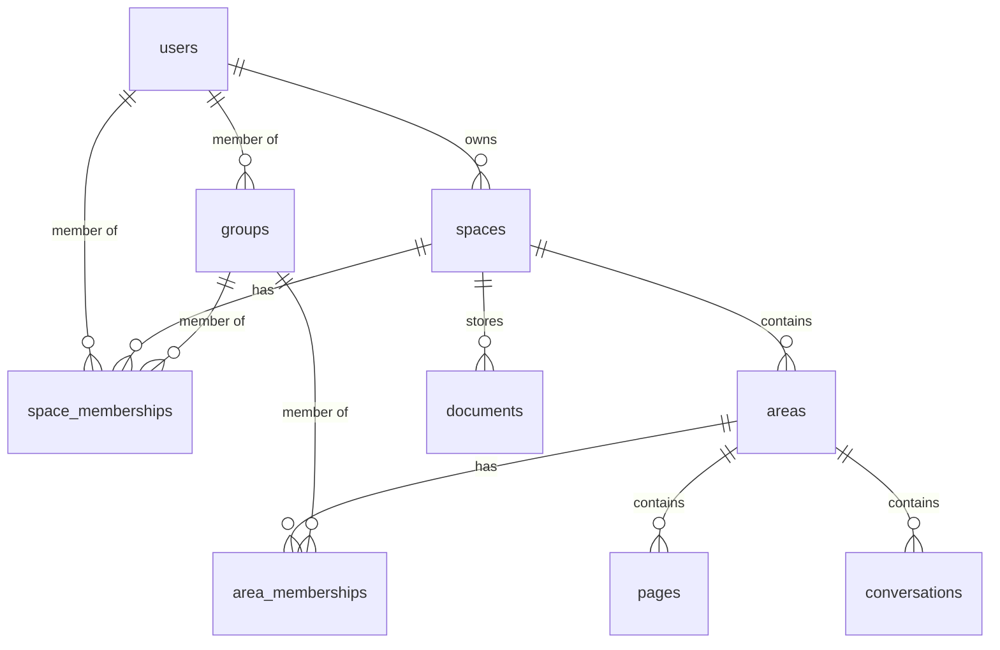

# Database Standardization & Documentation Project

**Status:** 🟡 In Progress
**Started:** 2026-01-14
**Target Completion:** 2 weeks
**Priority:** 🔴 Critical (blocks reliable feature development)

---

## 🤖 For Coding Agents: Quick Start

**If you're a coding agent working on this codebase, read this first:**

### Critical Rule: Always Use camelCase for Database Column Access

```typescript
// ❌ WRONG - This returns undefined!
const userId = row.user_id;

// ✅ CORRECT - postgres.js transforms columns to camelCase
const userId = row.userId;
```

### When Working with Database Code

1. **Check Phase Status** - See what's been completed below
2. **Follow Reference Patterns** - See "Reference Patterns" section for correct code
3. **Verify Your Changes** - Run `npm run audit-db-access` to check for violations
4. **Update Docs** - If adding migrations, run `npm run generate-schema-docs`

### Required Reading Before Database Work
- [postgres.js Guide](./database/POSTGRES_JS_GUIDE.md) - How column transformation works
- [Schema Reference](./database/SCHEMA_REFERENCE.md) - Table structures
- [Reference Patterns](#reference-patterns) - Copy these patterns

### Success Criteria for Your Work
- [ ] All property access uses camelCase (not snake_case)
- [ ] Type definitions match runtime shapes
- [ ] Nullable columns have `| null` in types and `??` for defaults
- [ ] Audit script shows 0 violations in your files
- [ ] TypeScript compiles with no errors

---

## Executive Summary

This project addresses critical technical debt in how our codebase interacts with PostgreSQL through postgres.js. The library's automatic `snake_case` → `camelCase` transformation has caused multiple production bugs where code silently fails by accessing undefined properties. Without standardization and documentation, every new feature risks similar bugs.

**Key Deliverables:**
1. Standardize all database access to use camelCase consistently
2. Create comprehensive database documentation for reference
3. Establish patterns and tooling to prevent future issues
4. Build auto-generation tools to keep docs in sync with schema

---

## Problem Statement

### Current State

**The Snake/Camel Case Confusion:**
- postgres.js automatically transforms column names: `user_id` → `userId`
- Our codebase has mixed patterns: some files use `snake_case`, others `camelCase`
- Type definitions don't always match runtime shapes
- Silent failures: `row.user_id` returns `undefined` instead of erroring

**Recent Bugs Caused:**
1. Member names showing "Unknown" (accessing `row.user_id` when it's `row.userId`)
2. Owner duplication (camelCase bug prevented existence check from working)
3. Multiple similar issues in space/area membership code

**Documentation Gaps:**
- No central reference for database schema
- No documentation of postgres.js transformation behavior
- No guide for handling nullable columns, joins, or access patterns
- Relationship maps exist only in developer's heads
- Migration impact analysis requires manual code search

### Risk Assessment

**Without This Work:**
- ❌ Every new feature risks silent undefined access bugs
- ❌ Refactoring is dangerous (can't identify all affected code)
- ❌ New developers will repeat the same mistakes
- ❌ Type safety is an illusion (types don't match runtime)
- ❌ Query optimization is guesswork without schema docs

**With This Work:**
- ✅ Clear patterns prevent snake/camel bugs
- ✅ Type safety actually protects against errors
- ✅ Schema docs enable confident refactoring
- ✅ New developers have reference guide
- ✅ Auto-generated docs stay in sync with migrations

---

## Goals and Success Criteria

### Primary Goals

1. **Eliminate snake_case/camelCase confusion**
   - All repository files use camelCase consistently
   - Type definitions match runtime shapes
   - Audit tooling catches violations

2. **Comprehensive database documentation**
   - Auto-generated schema reference
   - Manual relationship diagrams
   - Access pattern best practices
   - Migration history tracking

3. **Prevent future issues**
   - Developer guide for postgres.js
   - Lint rules catch violations
   - CI validates docs stay in sync
   - PR template includes database checklist

### Success Criteria

**Quantitative:**
- [ ] 0 files with mixed snake_case/camelCase access
- [ ] 100% of tables documented in schema reference
- [ ] 100% of migrations covered in history
- [ ] Auto-generation runs in <5 seconds
- [ ] All TypeScript interfaces match runtime shapes

**Qualitative:**
- [ ] Developer can find any table's structure in <30 seconds
- [ ] New feature doesn't require "trial and error" for column names
- [ ] Relationship impact analysis is straightforward
- [ ] Migration changes are traceable to affected code

---

## Decisions and Principles

### Decision Record

| Decision | Rationale | Status |
|----------|-----------|--------|
| **Adopt camelCase everywhere** | Work with postgres.js, not against it. Changing the library's behavior would require forking. | ✅ Decided |
| **Auto-generate schema docs** | Migrations are source of truth. Manual docs go stale. | ✅ Decided |
| **Keep manual relationship docs** | Diagrams and access control chains need human curation. | ✅ Decided |
| **Add postgres.js to tech stack docs** | Transformation behavior must be explicitly documented. | ✅ Decided |
| **Create audit script** | One-time tooling to find all current violations. | ✅ Decided |
| **Add lint rules** | Prevent future violations at development time. | 🟡 Planned |
| **CI validation** | Docs must stay in sync with schema changes. | 🟡 Planned |

### Core Principles

1. **Source of Truth:** Migrations define schema, code/docs reflect it
2. **Type Safety:** TypeScript interfaces must match runtime shapes exactly
3. **Fail Fast:** Prefer errors over silent undefined access
4. **Automation:** Generate what can be generated, maintain what requires judgment
5. **Discoverability:** Any developer should find what they need in <1 minute

---

## Implementation Phases

### Phase 0: Preparation (Day 1) ✅ DONE

- [x] Create project plan document (this file)
- [x] Review existing codebase patterns
- [x] Identify all repository files
- [x] Document recent bugs caused by this issue

**Acceptance:**
- Project plan reviewed and approved
- Scope clearly defined

---

### Phase 1: Foundation & Audit (Days 2-3) 🔲 TODO

#### 1.1: Create Documentation Structure

**Tasks:**
- [ ] Create `docs/database/` folder
- [ ] Create `docs/database/README.md` (navigation hub)
- [ ] Create `docs/database/POSTGRES_JS_GUIDE.md` (start from template below)
- [ ] Create placeholder files for other docs

**Acceptance:**
- Documentation structure exists
- README provides clear navigation
- POSTGRES_JS_GUIDE has transformation examples

**Template for POSTGRES_JS_GUIDE.md:**
```markdown
# postgres.js Guide for StratAI

## How Column Name Transformation Works

postgres.js automatically transforms database column names from `snake_case` to `camelCase`:

**Example:**
```typescript
// Database column: user_id
// Runtime access: row.userId

const rows = await sql<UserRow[]>`SELECT user_id FROM users`;
console.log(rows[0].user_id);  // ❌ undefined
console.log(rows[0].userId);   // ✅ works
```

## Query Alias Transformation

Aliases are ALSO transformed:

```typescript
const rows = await sql`SELECT user_id AS owner_id FROM users`;
console.log(rows[0].owner_id);  // ❌ undefined
console.log(rows[0].ownerId);   // ✅ works
```

## Join Column Transformation

ALL columns in SELECT are transformed:

```typescript
const rows = await sql`
    SELECT
        u.id as user_id,
        s.name as space_name
    FROM users u
    JOIN spaces s ON u.id = s.user_id
`;
// Runtime shape: { userId, spaceName }
```

## Standard Patterns

### Pattern 1: Type-Safe Row Access

```typescript
// Define row interface matching runtime shape
interface UserRow {
    id: string;
    email: string;
    displayName: string | null;  // Nullable columns = | null
    firstName: string | null;
    lastName: string | null;
    createdAt: Date;
}

// Use typed query
const rows = await sql<UserRow[]>`SELECT * FROM users WHERE id = ${id}`;
const user = rows[0];  // TypeScript knows shape
```

### Pattern 2: Nullable Column Handling

```typescript
// Database: display_name TEXT NULL
// Always provide fallback for nullable columns

const displayName = row.displayName ?? 'Unknown User';

// Or use COALESCE in query
const rows = await sql`
    SELECT COALESCE(display_name, 'Unknown') as display_name
    FROM users
`;
```

### Pattern 3: Name Fallback Pattern

```typescript
// Common pattern: display_name fallback to first_name + last_name
const rows = await sql`
    SELECT
        id,
        email,
        COALESCE(
            display_name,
            CONCAT_WS(' ', first_name, last_name)
        ) as display_name
    FROM users
`;
// Runtime: row.displayName (never null if first/last exist)
```

### Pattern 4: Row Converter Functions

```typescript
// Always use converter function for consistency
export function rowToUser(row: UserRow): User {
    return {
        id: row.id,
        email: row.email,
        displayName: row.displayName ?? null,
        firstName: row.firstName ?? null,
        lastName: row.lastName ?? null,
        createdAt: row.createdAt,
        updatedAt: row.updatedAt
    };
}
```

## Common Pitfalls

### Pitfall 1: Accessing snake_case
```typescript
// ❌ WRONG - returns undefined
const userId = row.user_id;

// ✅ CORRECT - postgres.js transformed it
const userId = row.userId;
```

### Pitfall 2: Type vs Runtime Mismatch
```typescript
// ❌ WRONG - type says userId but row has user_id at runtime
interface UserRow {
    user_id: string;  // Type uses snake_case
}
const rows = await sql<UserRow[]>`SELECT user_id FROM users`;
const id = rows[0].user_id;  // Type allows it but returns undefined!

// ✅ CORRECT - type matches runtime
interface UserRow {
    userId: string;  // Type uses camelCase
}
```

### Pitfall 3: Missing Null Checks
```typescript
// ❌ WRONG - will error if display_name is NULL
const name = row.displayName.toUpperCase();

// ✅ CORRECT - handle null
const name = row.displayName?.toUpperCase() ?? 'UNKNOWN';
```

## Debugging Tips

1. **Log the actual row shape:**
   ```typescript
   const rows = await sql`SELECT * FROM users LIMIT 1`;
   console.log('Row keys:', Object.keys(rows[0]));
   console.log('Row:', rows[0]);
   ```

2. **Check for undefined access:**
   ```typescript
   const userId = row.user_id;
   if (userId === undefined) {
       console.error('Accessed snake_case, should be camelCase!');
   }
   ```

3. **Use TypeScript strict mode:**
   - Enable `strictNullChecks` to catch nullable column issues
   - Enable `noUncheckedIndexedAccess` for safer access
```

---

#### 1.2: Create Audit Script

**Tasks:**
- [ ] Create `scripts/audit-db-access.ts`
- [ ] Implement pattern detection:
  - Direct property access with snake_case
  - Type definitions with snake_case
  - Mixed patterns in same file
  - Nullable columns without null checks
- [ ] Run audit and generate report
- [ ] Create issues list for each violation

**Script Template:**
```typescript
/**
 * Audit Database Access Patterns
 *
 * Scans all *-postgres.ts files for:
 * 1. Snake_case property access (row.user_id)
 * 2. Type definitions with snake_case
 * 3. Mixed patterns in same file
 * 4. Missing null checks on nullable columns
 */

import fs from 'fs';
import path from 'path';
import { glob } from 'glob';

interface AuditResult {
    file: string;
    violations: Violation[];
}

interface Violation {
    type: 'snake_case_access' | 'snake_case_type' | 'missing_null_check';
    line: number;
    content: string;
    suggestion: string;
}

async function auditDatabaseAccess() {
    const persistenceFiles = await glob(
        'src/lib/server/persistence/*-postgres.ts'
    );

    const results: AuditResult[] = [];

    for (const file of persistenceFiles) {
        const content = fs.readFileSync(file, 'utf-8');
        const violations = analyzeFile(content, file);

        if (violations.length > 0) {
            results.push({ file, violations });
        }
    }

    generateReport(results);
}

function analyzeFile(content: string, filePath: string): Violation[] {
    const violations: Violation[] = [];
    const lines = content.split('\n');

    lines.forEach((line, index) => {
        // Check for snake_case property access
        const snakeCaseAccess = line.match(/row\.([a-z]+_[a-z_]+)/g);
        if (snakeCaseAccess) {
            violations.push({
                type: 'snake_case_access',
                line: index + 1,
                content: line.trim(),
                suggestion: snakeCaseAccess.map(s =>
                    s.replace(/row\.([a-z]+_[a-z_]+)/, (_, snake) =>
                        `row.${toCamelCase(snake)}`
                    )
                ).join(', ')
            });
        }

        // Check for snake_case in type definitions
        const snakeCaseType = line.match(/^\s*([\w_]+):\s*\w+/);
        if (snakeCaseType && snakeCaseType[1].includes('_')) {
            violations.push({
                type: 'snake_case_type',
                line: index + 1,
                content: line.trim(),
                suggestion: `${toCamelCase(snakeCaseType[1])}: ...`
            });
        }
    });

    return violations;
}

function toCamelCase(str: string): string {
    return str.replace(/_([a-z])/g, (_, letter) => letter.toUpperCase());
}

function generateReport(results: AuditResult[]) {
    console.log('\n=== Database Access Audit Report ===\n');

    let totalViolations = 0;

    results.forEach(({ file, violations }) => {
        console.log(`\n📁 ${file}`);
        console.log(`   ${violations.length} violation(s)\n`);

        violations.forEach((v, i) => {
            console.log(`   ${i + 1}. [${v.type}] Line ${v.line}`);
            console.log(`      ❌ ${v.content}`);
            console.log(`      ✅ ${v.suggestion}\n`);
            totalViolations++;
        });
    });

    console.log(`\n=== Summary ===`);
    console.log(`Files with issues: ${results.length}`);
    console.log(`Total violations: ${totalViolations}`);
    console.log(`\nNext steps:`);
    console.log(`1. Review each violation`);
    console.log(`2. Fix using suggested patterns`);
    console.log(`3. Re-run audit to verify\n`);
}

auditDatabaseAccess();
```

**Acceptance:**
- Script runs successfully
- Generates clear report with line numbers
- Identifies all snake_case violations
- Report saved to `docs/database/AUDIT_REPORT.md`

---

#### 1.3: Document Current State

**Tasks:**
- [ ] Create `docs/database/AUDIT_REPORT.md` from script output
- [ ] List all affected files
- [ ] Categorize violations by severity
- [ ] Estimate fix effort per file

**Acceptance:**
- Complete list of files needing fixes
- Priority order established
- Effort estimates documented

---

### Phase 2: Repository Fixes (Days 4-6) 🔲 TODO

#### 2.1: Fix High-Priority Repositories

**Files to Fix (in order):**
1. [ ] `users-postgres.ts` (foundational)
2. [ ] `spaces-postgres.ts` (foundational)
3. [ ] `space-memberships-postgres.ts` (already partially fixed)
4. [ ] `areas-postgres.ts` (already partially fixed)
5. [ ] `area-memberships-postgres.ts` (already partially fixed)

**For Each File:**
- [ ] Update all property access to camelCase
- [ ] Update type definitions to match runtime
- [ ] Add null checks for nullable columns
- [ ] Test thoroughly with actual database
- [ ] Update related API endpoints if needed

**Standard Fix Pattern:**
```typescript
// BEFORE (broken)
interface UserRow {
    user_id: string;  // Type uses snake_case
    display_name: string | null;
}

const rows = await sql<UserRow[]>`SELECT * FROM users`;
const id = rows[0].user_id;  // Undefined!
const name = rows[0].display_name || 'Unknown';

// AFTER (correct)
interface UserRow {
    userId: string;  // Type matches runtime
    displayName: string | null;
}

const rows = await sql<UserRow[]>`SELECT * FROM users`;
const id = rows[0].userId;  // Works!
const name = rows[0].displayName ?? 'Unknown';
```

**Testing Checklist Per File:**
- [ ] TypeScript compiles with no errors
- [ ] All queries return expected data
- [ ] Null checks prevent runtime errors
- [ ] Related API endpoints still work
- [ ] Integration tests pass

**Acceptance:**
- All high-priority repositories use camelCase
- All type definitions match runtime
- No undefined access issues
- Full test coverage passes

---

#### 2.2: Fix Remaining Repositories

**Files to Fix:**
6. [ ] `documents-postgres.ts`
7. [ ] `pages-postgres.ts`
8. [ ] `conversations-postgres.ts`
9. [ ] `tasks-postgres.ts`
10. [ ] `groups-postgres.ts`
11. [ ] `routing-decisions-postgres.ts`
12. [ ] `user-preferences-postgres.ts`
13. [ ] Any other *-postgres.ts files

**Acceptance:**
- 100% of repository files use camelCase
- Audit script shows 0 violations
- All tests pass

---

#### 2.3: Update API Endpoints

**Tasks:**
- [ ] Review all API endpoints that use fixed repositories
- [ ] Verify they handle camelCase correctly
- [ ] Update any that still expect snake_case
- [ ] Test end-to-end flows

**Key Files:**
- `/api/users/**/*.ts`
- `/api/spaces/**/*.ts`
- `/api/areas/**/*.ts`
- `/api/documents/**/*.ts`
- `/api/pages/**/*.ts`

**Acceptance:**
- All API endpoints work with updated repositories
- Integration tests pass
- No breaking changes in API responses

---

### Phase 3: Schema Documentation (Days 7-9) 🔲 TODO

#### 3.1: Create Schema Generator

**Tasks:**
- [ ] Create `scripts/generate-schema-docs.ts`
- [ ] Parse all migration files (001-030+)
- [ ] Extract table definitions, columns, indexes
- [ ] Extract COMMENT ON statements for descriptions
- [ ] Generate markdown tables
- [ ] Include foreign key relationships
- [ ] Output to `docs/database/SCHEMA_REFERENCE.md`

**Generator Features:**
- Parse CREATE TABLE statements
- Parse ALTER TABLE ADD COLUMN
- Parse CREATE INDEX statements
- Parse COMMENT ON statements
- Track column types, nullability, defaults
- Map foreign keys
- Generate markdown tables
- Include SQL examples for each table

**Script Template:**
```typescript
/**
 * Generate Schema Reference Documentation
 *
 * Reads all migration files and generates comprehensive
 * schema documentation in markdown format.
 */

import fs from 'fs';
import path from 'path';

interface Table {
    name: string;
    columns: Column[];
    indexes: Index[];
    foreignKeys: ForeignKey[];
    comments: Record<string, string>;
}

interface Column {
    name: string;
    type: string;
    nullable: boolean;
    default: string | null;
    description: string | null;
}

interface Index {
    name: string;
    columns: string[];
    unique: boolean;
    where: string | null;
}

interface ForeignKey {
    column: string;
    references: string;
    onDelete: string;
}

async function generateSchemaDocs() {
    const migrationDir = 'src/lib/server/persistence/migrations';
    const migrations = fs.readdirSync(migrationDir)
        .filter(f => f.endsWith('.sql'))
        .sort();

    const tables = new Map<string, Table>();

    // Parse each migration
    for (const file of migrations) {
        const content = fs.readFileSync(
            path.join(migrationDir, file),
            'utf-8'
        );
        parseMigration(content, tables);
    }

    // Generate markdown
    const markdown = generateMarkdown(tables);

    // Write to docs
    fs.writeFileSync(
        'docs/database/SCHEMA_REFERENCE.md',
        markdown
    );

    console.log(`✅ Generated schema docs for ${tables.size} tables`);
}

function parseMigration(sql: string, tables: Map<string, Table>) {
    // Parse CREATE TABLE
    const createTableRegex = /CREATE TABLE IF NOT EXISTS (\w+)\s*\(([\s\S]*?)\);/gi;
    let match;

    while ((match = createTableRegex.exec(sql)) !== null) {
        const tableName = match[1];
        const columnDefs = match[2];

        const table: Table = {
            name: tableName,
            columns: parseColumns(columnDefs),
            indexes: [],
            foreignKeys: [],
            comments: {}
        };

        tables.set(tableName, table);
    }

    // Parse ALTER TABLE ADD COLUMN
    const alterTableRegex = /ALTER TABLE (\w+)\s+ADD COLUMN IF NOT EXISTS (\w+)\s+([^;]+);/gi;
    while ((match = alterTableRegex.exec(sql)) !== null) {
        const tableName = match[1];
        const columnName = match[2];
        const columnDef = match[3];

        const table = tables.get(tableName);
        if (table) {
            table.columns.push(parseColumnDef(columnName, columnDef));
        }
    }

    // Parse CREATE INDEX
    const indexRegex = /CREATE (UNIQUE )?INDEX IF NOT EXISTS (\w+)\s+ON (\w+)\s*\(([\w\s,]+)\)(?:\s+WHERE (.+))?;/gi;
    while ((match = indexRegex.exec(sql)) !== null) {
        const unique = !!match[1];
        const indexName = match[2];
        const tableName = match[3];
        const columns = match[4].split(',').map(s => s.trim());
        const whereClause = match[5] || null;

        const table = tables.get(tableName);
        if (table) {
            table.indexes.push({ name: indexName, columns, unique, where: whereClause });
        }
    }

    // Parse COMMENT ON
    const commentRegex = /COMMENT ON COLUMN (\w+)\.(\w+) IS\s+'([^']+)'/gi;
    while ((match = commentRegex.exec(sql)) !== null) {
        const tableName = match[1];
        const columnName = match[2];
        const comment = match[3];

        const table = tables.get(tableName);
        if (table) {
            table.comments[columnName] = comment;
            // Update column description
            const column = table.columns.find(c => c.name === columnName);
            if (column) {
                column.description = comment;
            }
        }
    }
}

function parseColumns(columnDefs: string): Column[] {
    // Simplified parser - would need more robust implementation
    const columns: Column[] = [];
    const lines = columnDefs.split('\n').map(l => l.trim()).filter(Boolean);

    for (const line of lines) {
        if (line.startsWith('CONSTRAINT') || line.startsWith('CHECK')) continue;

        const match = line.match(/^(\w+)\s+([A-Z\[\]]+)(?:\s+(NOT NULL|NULL))?(?:\s+DEFAULT\s+(.+?))?(?:,|$)/i);
        if (match) {
            columns.push({
                name: match[1],
                type: match[2],
                nullable: match[3] !== 'NOT NULL',
                default: match[4] || null,
                description: null
            });
        }
    }

    return columns;
}

function generateMarkdown(tables: Map<string, Table>): string {
    let md = '# Database Schema Reference\n\n';
    md += `**Generated:** ${new Date().toISOString()}\n`;
    md += `**Tables:** ${tables.size}\n\n`;

    md += '## Table of Contents\n\n';
    for (const [name] of tables) {
        md += `- [${name}](#${name})\n`;
    }
    md += '\n---\n\n';

    for (const [name, table] of tables) {
        md += generateTableDoc(name, table);
    }

    return md;
}

function generateTableDoc(name: string, table: Table): string {
    let md = `## ${name}\n\n`;

    // Columns table
    md += '### Columns\n\n';
    md += '| Column | Type | Nullable | Default | Description |\n';
    md += '|--------|------|----------|---------|-------------|\n';

    for (const col of table.columns) {
        const nullable = col.nullable ? 'YES' : 'NO';
        const defaultVal = col.default || '-';
        const desc = col.description || '-';
        md += `| ${col.name} | ${col.type} | ${nullable} | ${defaultVal} | ${desc} |\n`;
    }
    md += '\n';

    // Indexes
    if (table.indexes.length > 0) {
        md += '### Indexes\n\n';
        for (const idx of table.indexes) {
            const unique = idx.unique ? 'UNIQUE ' : '';
            const where = idx.where ? ` WHERE ${idx.where}` : '';
            md += `- **${idx.name}**: ${unique}INDEX (${idx.columns.join(', ')})${where}\n`;
        }
        md += '\n';
    }

    // Access pattern example
    md += '### Access Pattern\n\n';
    md += '```typescript\n';
    md += `// Query ${name}\n`;
    md += `const rows = await sql<${toPascalCase(name)}Row[]>\`\n`;
    md += `    SELECT * FROM ${name}\n`;
    md += `    WHERE id = \${id}\n`;
    md += `\`;\n\n`;
    md += '// Runtime shape (camelCase):\n';
    md += '// {\n';
    for (const col of table.columns.slice(0, 5)) {
        const camelName = toCamelCase(col.name);
        const nullSuffix = col.nullable ? ' | null' : '';
        md += `//   ${camelName}: ${mapType(col.type)}${nullSuffix},\n`;
    }
    if (table.columns.length > 5) {
        md += '//   ...\n';
    }
    md += '// }\n';
    md += '```\n\n';

    md += '---\n\n';
    return md;
}

function toCamelCase(str: string): string {
    return str.replace(/_([a-z])/g, (_, letter) => letter.toUpperCase());
}

function toPascalCase(str: string): string {
    const camel = toCamelCase(str);
    return camel.charAt(0).toUpperCase() + camel.slice(1);
}

function mapType(sqlType: string): string {
    if (sqlType.includes('TEXT')) return 'string';
    if (sqlType.includes('INT')) return 'number';
    if (sqlType.includes('BOOLEAN')) return 'boolean';
    if (sqlType.includes('TIMESTAMPTZ')) return 'Date';
    if (sqlType.includes('UUID')) return 'string';
    if (sqlType.includes('[]')) return mapType(sqlType.replace('[]', '')) + '[]';
    if (sqlType.includes('JSONB')) return 'object';
    return 'unknown';
}

generateSchemaDocs();
```

**Acceptance:**
- Script runs successfully
- Generates complete schema reference
- All tables documented with columns, types, nullability
- Includes indexes and foreign keys
- Runtime shape examples included

---

#### 3.2: Create Relationship Documentation

**Tasks:**
- [ ] Create `docs/database/RELATIONSHIPS.md`
- [ ] Add mermaid ER diagrams
- [ ] Document access control chains
- [ ] Document common join patterns
- [ ] Map entity dependencies

**Template:**
```markdown
# Entity Relationships

## Overview



## Access Control Chains

### Space Access

A user can access a space if ANY of:

1. **Owner**: `spaces.user_id = userId`
2. **Direct Membership**: `space_memberships.user_id = userId`
3. **Group Membership**:
   ```sql
   EXISTS (
       SELECT 1 FROM space_memberships sm
       JOIN group_memberships gm ON sm.group_id = gm.group_id
       WHERE sm.space_id = spaceId
         AND gm.user_id = userId
   )
   ```

**Implementation:** `canAccessSpace(userId, spaceId)` in `space-memberships-postgres.ts`

### Area Access

A user can access an area if ANY of:

1. **Creator**: `areas.created_by = userId`
2. **Direct Membership**: `area_memberships.user_id = userId`
3. **Group Membership**: (similar to space)
4. **Space Access** (only if `area.is_restricted = false`):
   ```sql
   area.is_restricted = false
   AND canAccessSpace(userId, area.space_id)
   AND space_membership.role != 'guest'
   ```

**Implementation:** `canAccessArea(userId, areaId)` in `area-memberships-postgres.ts`

## Common Join Patterns

### User with Display Name Fallback

```sql
SELECT
    u.id,
    u.email,
    COALESCE(u.display_name, CONCAT_WS(' ', u.first_name, u.last_name)) as display_name
FROM users u
-- Runtime: { id, email, displayName }
```

### Space with Member Count

```sql
SELECT
    s.*,
    COUNT(sm.id) as member_count
FROM spaces s
LEFT JOIN space_memberships sm ON s.id = sm.space_id
GROUP BY s.id
-- Runtime: { ...spaceFields, memberCount }
```

### Areas with Access Info

```sql
WITH accessible_areas AS (
    -- Owner
    SELECT id FROM areas WHERE created_by = ${userId}
    UNION
    -- Direct member
    SELECT area_id FROM area_memberships WHERE user_id = ${userId}
    UNION
    -- Space access (non-restricted)
    SELECT a.id FROM areas a
    WHERE a.is_restricted = false
      AND canAccessSpace(${userId}, a.space_id)
)
SELECT a.* FROM areas a
JOIN accessible_areas aa ON a.id = aa.id
```

## Entity Dependencies

### Cascading Deletes

When a **Space** is deleted:
- ✅ Areas are deleted (ON DELETE CASCADE)
- ✅ Space memberships are deleted (ON DELETE CASCADE)
- ✅ Documents are deleted (ON DELETE CASCADE)

When an **Area** is deleted:
- ✅ Area memberships are deleted (ON DELETE CASCADE)
- ⚠️ Pages are moved to General (soft delete logic)
- ⚠️ Conversations are moved to General (soft delete logic)

When a **User** is deleted:
- ⚠️ Spaces are NOT deleted (orphaned - need policy)
- ✅ Memberships are deleted (ON DELETE CASCADE)
- ⚠️ Created content is NOT deleted (orphaned - need policy)

### Impact Analysis

**Changing `users.id`:**
- Breaks: spaces.user_id, space_memberships.user_id, area_memberships.user_id
- Risk: HIGH (foundational FK)
- Testing: All access control

**Changing `spaces.id`:**
- Breaks: areas.space_id, space_memberships.space_id, documents.space_id
- Risk: HIGH (foundational FK)
- Testing: All nested entities

**Adding `areas.is_restricted`:**
- Affects: canAccessArea logic, area listing queries
- Risk: MEDIUM (changes access control)
- Testing: Area sharing, member visibility
```

**Acceptance:**
- Relationship diagrams are accurate
- Access control chains documented
- Common join patterns included
- Impact analysis helps with changes

---

#### 3.3: Create Access Patterns Guide

**Tasks:**
- [ ] Create `docs/database/ACCESS_PATTERNS.md`
- [ ] Document standard CRUD patterns
- [ ] Document join patterns
- [ ] Document access control patterns
- [ ] Include performance tips

**Acceptance:**
- All common patterns documented
- Code examples included
- Performance considerations noted

---

#### 3.4: Create Migration History

**Tasks:**
- [ ] Create `docs/database/MIGRATIONS_HISTORY.md`
- [ ] List all migrations chronologically
- [ ] Document what each migration changed
- [ ] Note impact on existing code
- [ ] Auto-generate from migration files

**Acceptance:**
- Complete migration history
- Impact noted for each change
- Easy to search for when columns were added

---

#### 3.5: Create Type Mapping Guide

**Tasks:**
- [ ] Create `docs/database/TYPE_MAPPING.md`
- [ ] Document PostgreSQL → TypeScript mapping
- [ ] Document nullable handling
- [ ] Document array/JSONB handling
- [ ] Include examples for each type

**Acceptance:**
- Clear type mapping reference
- Examples for all common types
- Nullable patterns documented

---

### Phase 4: Tooling & Prevention (Days 10-11) 🔲 TODO

#### 4.1: Create Lint Rule

**Tasks:**
- [ ] Add ESLint custom rule for snake_case property access
- [ ] Configure to check all *-postgres.ts files
- [ ] Add to pre-commit hook
- [ ] Test with existing code

**Rule Implementation:**
```javascript
// .eslintrc.js
{
    rules: {
        'no-snake-case-db-access': 'error'
    }
}

// custom-rules/no-snake-case-db-access.js
module.exports = {
    meta: {
        type: 'problem',
        docs: {
            description: 'Disallow snake_case property access on database rows',
            category: 'Possible Errors',
            recommended: true
        }
    },
    create(context) {
        return {
            MemberExpression(node) {
                if (node.property.type === 'Identifier') {
                    const propName = node.property.name;
                    if (propName.includes('_')) {
                        // Check if this is a row access pattern
                        if (node.object.name === 'row' ||
                            node.object.name === 'rows') {
                            context.report({
                                node,
                                message: `Use camelCase for database column access: ${propName} should be ${toCamelCase(propName)}`
                            });
                        }
                    }
                }
            }
        };
    }
};
```

**Acceptance:**
- Lint rule catches snake_case access
- False positives are minimal
- Pre-commit hook prevents violations

---

#### 4.2: Add CI Validation

**Tasks:**
- [ ] Create GitHub Action to validate schema docs
- [ ] Run schema generator on CI
- [ ] Fail if docs are out of sync with migrations
- [ ] Add to PR checks

**CI Workflow:**
```yaml
# .github/workflows/validate-db-docs.yml
name: Validate Database Documentation

on:
  pull_request:
    paths:
      - 'src/lib/server/persistence/migrations/**'
      - 'docs/database/**'

jobs:
  validate:
    runs-on: ubuntu-latest
    steps:
      - uses: actions/checkout@v3

      - name: Setup Node
        uses: actions/setup-node@v3
        with:
          node-version: '18'

      - name: Install dependencies
        run: npm ci

      - name: Generate schema docs
        run: npm run generate-schema-docs

      - name: Check for changes
        run: |
          git diff --exit-code docs/database/SCHEMA_REFERENCE.md
          if [ $? -ne 0 ]; then
            echo "❌ Schema docs are out of sync with migrations"
            echo "Run: npm run generate-schema-docs"
            exit 1
          fi
```

**Acceptance:**
- CI runs on PR
- Fails if docs out of sync
- Clear error messages

---

#### 4.3: Update PR Template

**Tasks:**
- [ ] Add database checklist to PR template
- [ ] Remind about schema doc updates
- [ ] Link to postgres.js guide

**Template Addition:**
```markdown
## Database Changes

If this PR modifies the database schema or persistence layer:

- [ ] Migration file created (if schema changed)
- [ ] Schema docs regenerated (`npm run generate-schema-docs`)
- [ ] Repository uses camelCase for column access
- [ ] Type definitions match runtime shapes
- [ ] Null checks added for nullable columns
- [ ] Access patterns documented (if new pattern)
- [ ] Lint checks pass (no snake_case violations)

See: [PostgreSQL Guide](../docs/database/POSTGRES_JS_GUIDE.md)
```

**Acceptance:**
- PR template updated
- Checklist is actionable
- Links to relevant docs

---

### Phase 5: Integration & Testing (Days 12-13) 🔲 TODO

#### 5.1: End-to-End Testing

**Tasks:**
- [ ] Test all API endpoints
- [ ] Test all access control flows
- [ ] Test edge cases (null values, missing data)
- [ ] Load test to verify no performance regression
- [ ] Test with real production-like data

**Test Scenarios:**
- User signup/login flow
- Space creation and membership
- Area creation and sharing
- Document upload and activation
- Page creation and collaboration
- All search endpoints
- All member list endpoints

**Acceptance:**
- All E2E tests pass
- No undefined access errors
- Performance is acceptable

---

#### 5.2: Documentation Review

**Tasks:**
- [ ] Review all generated docs for accuracy
- [ ] Get team feedback on documentation
- [ ] Fix any gaps or errors
- [ ] Ensure examples work

**Acceptance:**
- Documentation is accurate
- Examples are copy-pasteable and work
- Team approves docs

---

#### 5.3: Rollout Plan

**Tasks:**
- [ ] Create rollout checklist
- [ ] Plan for monitoring after deploy
- [ ] Document rollback plan
- [ ] Train team on new patterns

**Acceptance:**
- Rollout plan documented
- Team trained
- Monitoring in place

---

### Phase 6: Maintenance & Evolution (Ongoing) 🔲 TODO

#### 6.1: Ongoing Practices

**Establish:**
- [ ] Run schema generator after each migration
- [ ] Review audit script quarterly
- [ ] Update relationship docs when access control changes
- [ ] Keep postgres.js guide updated

**Acceptance:**
- Practices documented
- Team commits to following them

---

#### 6.2: Quarterly Review

**Tasks:**
- [ ] Review all database documentation
- [ ] Update outdated examples
- [ ] Check for new patterns to document
- [ ] Run audit script to catch drift

**Acceptance:**
- Scheduled quarterly review
- Process documented

---

## Reference Patterns

### Pattern 1: Standard Repository Query

```typescript
// ✅ CORRECT: Type-safe query with camelCase access
interface UserRow {
    id: string;
    email: string;
    displayName: string | null;
    createdAt: Date;
}

async findById(id: string): Promise<User | null> {
    const rows = await sql<UserRow[]>`
        SELECT * FROM users WHERE id = ${id}
    `;
    return rows.length > 0 ? rowToUser(rows[0]) : null;
}

function rowToUser(row: UserRow): User {
    return {
        id: row.id,  // camelCase access
        email: row.email,
        displayName: row.displayName ?? 'Unknown',  // null handling
        createdAt: row.createdAt
    };
}
```

### Pattern 2: Join with Alias

```typescript
// ✅ CORRECT: Aliases are also transformed to camelCase
const rows = await sql<{
    userId: string;
    userEmail: string;
    spaceName: string;
}[]>`
    SELECT
        u.id as user_id,
        u.email as user_email,
        s.name as space_name
    FROM users u
    JOIN spaces s ON u.id = s.user_id
    WHERE s.id = ${spaceId}
`;

// Access: row.userId, row.userEmail, row.spaceName
```

### Pattern 3: Nullable Column with Fallback

```typescript
// ✅ CORRECT: COALESCE in SQL or ?? in TypeScript
const rows = await sql`
    SELECT
        id,
        COALESCE(display_name, CONCAT_WS(' ', first_name, last_name)) as display_name
    FROM users
`;
// Runtime: row.displayName (never null if names exist)

// Or handle in TypeScript:
const displayName = row.displayName ?? row.firstName ?? 'Unknown';
```

### Pattern 4: Update Statement

```typescript
// ✅ CORRECT: SQL uses snake_case, TypeScript object uses camelCase
async update(id: string, updates: UpdateUserInput): Promise<User | null> {
    await sql`
        UPDATE users
        SET
            display_name = ${updates.displayName === undefined
                ? sql`display_name`
                : updates.displayName},
            first_name = ${updates.firstName === undefined
                ? sql`first_name`
                : updates.firstName},
            updated_at = NOW()
        WHERE id = ${id}
    `;
    return this.findById(id);
}
```

---

## Testing & Validation

### Validation Checklist

After each phase, verify:

**Code Quality:**
- [ ] TypeScript compiles with no errors
- [ ] No ESLint violations
- [ ] Audit script shows 0 issues

**Functionality:**
- [ ] All API endpoints work
- [ ] No undefined access errors in logs
- [ ] Access control works correctly

**Documentation:**
- [ ] Schema docs match migrations
- [ ] Examples are accurate
- [ ] Links work

**Performance:**
- [ ] No query performance regression
- [ ] Page load times acceptable

### Test Commands

```bash
# Run audit script
npm run audit-db-access

# Generate schema docs
npm run generate-schema-docs

# Type check
npm run check

# Lint
npm run lint

# Full test suite
npm test

# E2E tests
npm run test:e2e
```

---

## Progress Tracking

### Phase Completion

- [x] Phase 0: Preparation (Day 1)
- [ ] Phase 1: Foundation & Audit (Days 2-3)
- [ ] Phase 2: Repository Fixes (Days 4-6)
- [ ] Phase 3: Schema Documentation (Days 7-9)
- [ ] Phase 4: Tooling & Prevention (Days 10-11)
- [ ] Phase 5: Integration & Testing (Days 12-13)
- [ ] Phase 6: Maintenance & Evolution (Ongoing)

### Key Metrics

Track these metrics as we progress:

| Metric | Start | Current | Target |
|--------|-------|---------|--------|
| Files with snake_case | TBD | - | 0 |
| Tables documented | 0 | - | 21 |
| Type mismatches | TBD | - | 0 |
| Audit violations | TBD | - | 0 |
| Test coverage (persistence) | TBD | - | 80%+ |

---

## Session Notes

Use this section to track work across multiple Claude sessions:

### Session 2026-01-14
- Created project plan document
- Documented recent bugs (member names, duplicate owner, General area, access control)
- Established camelCase standard
- Defined 6-phase implementation plan

### Session [DATE]
[Add notes here as you work through phases]

---

## Quick Reference

### Common Commands

```bash
# Audit database access patterns
npm run audit-db-access

# Generate schema documentation
npm run generate-schema-docs

# Run TypeScript checks
npm run check

# Run database migrations
npm run migrate

# Run tests
npm test
```

### Key Files

- **This Plan:** `docs/DATABASE_STANDARDIZATION_PROJECT.md`
- **postgres.js Guide:** `docs/database/POSTGRES_JS_GUIDE.md`
- **Schema Reference:** `docs/database/SCHEMA_REFERENCE.md`
- **Relationships:** `docs/database/RELATIONSHIPS.md`
- **Audit Script:** `scripts/audit-db-access.ts`
- **Schema Generator:** `scripts/generate-schema-docs.ts`

### Decision Log References

- **Adopt camelCase:** Work with postgres.js transformation, not against it
- **Auto-generate schema:** Migrations are source of truth, docs reflect them
- **Lint enforcement:** Catch violations at development time, not runtime
- **CI validation:** Docs must stay in sync with schema changes

---

## Success Indicators

We'll know this project succeeded when:

1. ✅ **Zero snake_case bugs** - No more undefined access issues
2. ✅ **Fast documentation lookup** - Any developer finds table info in <30 seconds
3. ✅ **Confident refactoring** - Can identify all affected code for schema changes
4. ✅ **New developer success** - Onboarding doesn't require "trial and error" for column names
5. ✅ **Automated validation** - CI catches violations before merge
6. ✅ **Living documentation** - Docs stay in sync automatically

---

## Project-Wide Success Criteria

### For Completion Sign-Off

This project is complete when ALL of the following are true:

#### Code Quality ✅
- [ ] Audit script reports 0 violations across all files
- [ ] All *-postgres.ts files use camelCase exclusively
- [ ] All TypeScript interfaces match runtime column shapes
- [ ] ESLint passes with snake_case detection rule
- [ ] TypeScript compiles with `strictNullChecks` enabled
- [ ] All nullable columns have proper `| null` types
- [ ] All repository files have row converter functions

#### Documentation ✅
- [ ] All 21 tables documented in SCHEMA_REFERENCE.md
- [ ] POSTGRES_JS_GUIDE.md complete with examples
- [ ] RELATIONSHIPS.md includes all FK relationships
- [ ] ACCESS_PATTERNS.md covers all common queries
- [ ] MIGRATIONS_HISTORY.md includes all 30+ migrations
- [ ] TYPE_MAPPING.md documents all PostgreSQL types
- [ ] All documentation examples are copy-pasteable and work

#### Tooling ✅
- [ ] Schema generator script works (generates docs from migrations)
- [ ] Audit script catches all snake_case violations
- [ ] ESLint rule catches snake_case property access
- [ ] CI validates schema docs stay in sync
- [ ] Pre-commit hooks prevent violations
- [ ] npm scripts documented and working

#### Testing ✅
- [ ] All existing tests pass
- [ ] E2E tests cover all API endpoints
- [ ] No undefined access errors in any logs
- [ ] Access control tests pass (space/area membership)
- [ ] Performance tests show no regression
- [ ] Load tests with production-like data pass

#### Process ✅
- [ ] PR template includes database checklist
- [ ] Team trained on postgres.js patterns
- [ ] Quarterly review scheduled
- [ ] Rollback plan documented
- [ ] Monitoring alerts configured for undefined access
- [ ] CLAUDE.md references this project plan

#### Validation from Fresh Clone ✅
To truly verify completion, test with a fresh clone:

```bash
# Clone repo fresh
git clone [repo] temp-validation
cd temp-validation

# Install and check
npm install
npm run check  # Should pass
npm run lint   # Should pass
npm run audit-db-access  # Should show 0 violations

# Generate docs
npm run generate-schema-docs
git diff docs/  # Should show no changes

# Run tests
npm test  # Should pass
npm run test:e2e  # Should pass

# Manual verification
# 1. View schema docs - all tables present?
# 2. Try example code from docs - does it work?
# 3. Search codebase for "row\." - all camelCase?
```

---

## For Coding Agents: Implementation Guidelines

### When Fixing a Repository File

**Phase 2 Task - Follow this checklist for each file:**

1. **Read the file** to understand current implementation
2. **Check audit report** for known violations in this file
3. **Update type definitions** to use camelCase:
   ```typescript
   // Change this:
   interface UserRow {
       user_id: string;
       display_name: string | null;
   }

   // To this:
   interface UserRow {
       userId: string;
       displayName: string | null;
   }
   ```

4. **Update all property access**:
   ```typescript
   // Change this:
   const id = row.user_id;

   // To this:
   const id = row.userId;
   ```

5. **Add null handling** for nullable columns:
   ```typescript
   // Change this:
   const name = row.displayName || 'Unknown';

   // To this:
   const name = row.displayName ?? 'Unknown';
   ```

6. **Update row converter** if it exists:
   ```typescript
   function rowToUser(row: UserRow): User {
       return {
           id: row.userId,  // camelCase
           email: row.email,
           displayName: row.displayName ?? null,
           createdAt: row.createdAt
       };
   }
   ```

7. **Run validation**:
   ```bash
   npm run check  # TypeScript
   npm run audit-db-access  # Our custom check
   ```

8. **Test the file** - Ensure all queries work
9. **Check related API endpoints** - Update if needed
10. **Mark task complete** in this document

### When Creating New Repository Files

**Follow this template exactly:**

```typescript
/**
 * [Entity] PostgreSQL Repository
 */

import { sql } from './db';
import type { Entity, EntityRow, CreateEntityInput, UpdateEntityInput } from '$lib/types/entities';

/**
 * Row interface - matches runtime shape from postgres.js (camelCase)
 * IMPORTANT: postgres.js transforms snake_case columns to camelCase
 */
interface EntityRow {
    id: string;
    userId: string;  // database: user_id
    displayName: string | null;  // database: display_name
    createdAt: Date;
    updatedAt: Date;
}

/**
 * Convert database row to domain entity
 */
function rowToEntity(row: EntityRow): Entity {
    return {
        id: row.id,
        userId: row.userId,
        displayName: row.displayName ?? 'Unknown',  // Handle null
        createdAt: row.createdAt,
        updatedAt: row.updatedAt
    };
}

export const postgresEntityRepository = {
    async findById(id: string): Promise<Entity | null> {
        const rows = await sql<EntityRow[]>`
            SELECT * FROM entities WHERE id = ${id}
        `;
        return rows.length > 0 ? rowToEntity(rows[0]) : null;
    },

    async create(input: CreateEntityInput): Promise<Entity> {
        const now = new Date();

        // SQL uses snake_case
        await sql`
            INSERT INTO entities (
                id, user_id, display_name, created_at, updated_at
            ) VALUES (
                ${input.id},
                ${input.userId},
                ${input.displayName},
                ${now},
                ${now}
            )
        `;

        const entity = await this.findById(input.id);
        if (!entity) throw new Error('Failed to create entity');
        return entity;
    },

    async update(id: string, updates: UpdateEntityInput): Promise<Entity | null> {
        // SQL uses snake_case for column names
        await sql`
            UPDATE entities
            SET
                display_name = ${updates.displayName === undefined
                    ? sql`display_name`
                    : updates.displayName},
                updated_at = NOW()
            WHERE id = ${id}
        `;

        return this.findById(id);
    }
};
```

### When Writing Queries with Joins

**Follow this pattern for joins with name fallbacks:**

```typescript
const rows = await sql<{
    userId: string;
    userEmail: string;
    userDisplayName: string;  // Note: camelCase, even though aliased
    spaceId: string;
    spaceName: string;
}[]>`
    SELECT
        u.id as user_id,
        u.email as user_email,
        COALESCE(u.display_name, CONCAT_WS(' ', u.first_name, u.last_name)) as user_display_name,
        s.id as space_id,
        s.name as space_name
    FROM users u
    JOIN spaces s ON u.id = s.user_id
    WHERE s.id = ${spaceId}
`;

// Access properties in camelCase (postgres.js transforms aliases too!)
const userId = rows[0].userId;
const userName = rows[0].userDisplayName;
```

### Common Mistakes to Avoid

❌ **Mistake 1: Accessing snake_case**
```typescript
const id = row.user_id;  // Returns undefined!
```

❌ **Mistake 2: Type doesn't match runtime**
```typescript
interface UserRow {
    user_id: string;  // Type says snake_case
}
// But postgres.js actually returns: { userId: string }
```

❌ **Mistake 3: Not handling null**
```typescript
const name = row.displayName.toUpperCase();  // Error if null!
```

❌ **Mistake 4: Forgetting alias transformation**
```typescript
const rows = await sql`SELECT user_id as owner_id FROM users`;
console.log(rows[0].owner_id);  // undefined!
// Should be: rows[0].ownerId
```

✅ **Correct Pattern:**
```typescript
// Type matches runtime (camelCase)
interface UserRow {
    userId: string;
    displayName: string | null;
}

// Safe access with null handling
const rows = await sql<UserRow[]>`SELECT user_id, display_name FROM users`;
const id = rows[0].userId;  // Works!
const name = rows[0].displayName ?? 'Unknown';  // Safe!
```

---

**Last Updated:** 2026-01-14
**Owner:** Development Team
**Status:** 🟡 Phase 0 Complete, Phase 1 Ready to Start
