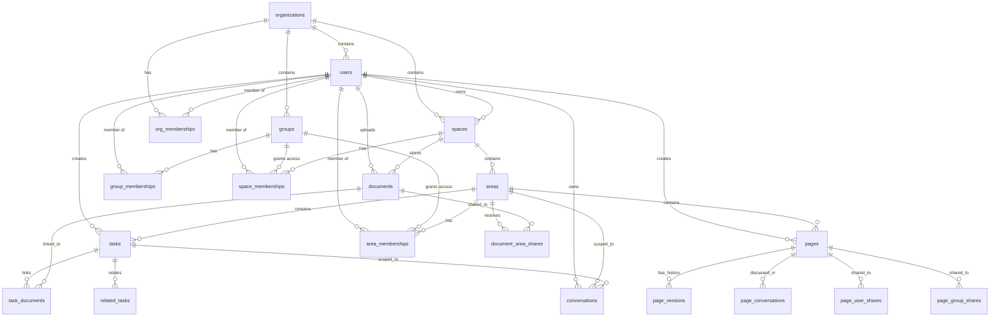

# Entity Relationships

> Documentation of foreign key relationships, access control chains, and entity dependencies.

---

## Entity Relationship Diagram



---

## Access Control Chains

### Space Access

A user can access a space if ANY of:

1. **Owner**: `spaces.user_id = userId`
2. **Direct Membership**: `space_memberships.user_id = userId`
3. **Group Membership**: User belongs to a group that has space membership

```typescript
// Implementation: space-memberships-postgres.ts
async function canAccessSpace(userId: string, spaceId: string): Promise<SpaceAccessResult>
```

```sql
WITH space_info AS (
    SELECT id, user_id FROM spaces WHERE id = $spaceId
),
direct_membership AS (
    SELECT role FROM space_memberships
    WHERE space_id = $spaceId AND user_id = $userId
),
group_membership AS (
    SELECT sm.role
    FROM space_memberships sm
    JOIN group_memberships gm ON sm.group_id = gm.group_id
    WHERE sm.space_id = $spaceId AND gm.user_id = $userId
)
SELECT
    COALESCE(s.user_id = $userId, false) as isOwner,
    dm.role as membershipRole,
    gm.role as groupRole
FROM space_info s
LEFT JOIN direct_membership dm ON true
LEFT JOIN group_membership gm ON true
```

### Area Access

A user can access an area if ANY of:

1. **Creator**: `areas.created_by = userId`
2. **Direct Membership**: `area_memberships.user_id = userId`
3. **Group Membership**: User belongs to a group with area membership
4. **Space Access** (only if `area.is_restricted = false`):
   - User has space access AND role != 'guest'

```typescript
// Implementation: area-memberships-postgres.ts
async function canAccessArea(userId: string, areaId: string): Promise<AreaAccessResult>
```

### Document Access

A user can access a document if ANY of:

1. **Owner**: `documents.user_id = userId`
2. **Space Visibility**: `documents.visibility = 'space'` AND user has space access
3. **Area Sharing**: `documents.visibility = 'areas'` AND document is shared with an area user can access

```typescript
// Implementation: documents-postgres.ts, document-sharing-postgres.ts
```

### Page Access

A user can access a page if ANY of:

1. **Creator**: `pages.created_by = userId`
2. **Area Visibility**: `pages.visibility = 'area'` AND user has area access
3. **Space Visibility**: `pages.visibility = 'space'` AND user has space access
4. **Specific Share**: User or user's group is in page shares

```typescript
// Implementation: pages-postgres.ts, page-sharing-postgres.ts
```

---

## Common Join Patterns

### User with Display Name Fallback

```typescript
// Runtime: row.displayName is never null if first/last exist
const rows = await sql`
    SELECT
        u.id,
        u.email,
        COALESCE(u.display_name, CONCAT_WS(' ', u.first_name, u.last_name)) as display_name
    FROM users u
`;

// Access: row.displayName (camelCase)
```

### Space with Member Count

```typescript
const rows = await sql<(SpaceRow & { memberCount: number })[]>`
    SELECT
        s.*,
        COUNT(sm.id) as member_count
    FROM spaces s
    LEFT JOIN space_memberships sm ON s.id = sm.space_id
    GROUP BY s.id
`;

// Access: row.memberCount (camelCase)
```

### Areas with User Role

```typescript
const rows = await sql<(AreaRow & { userRole: string })[]>`
    WITH user_access AS (
        SELECT area_id, role
        FROM area_memberships
        WHERE user_id = ${userId}
    )
    SELECT a.*, ua.role as user_role
    FROM areas a
    LEFT JOIN user_access ua ON a.id = ua.area_id
    WHERE a.space_id = ${spaceId}
`;

// Access: row.userRole (camelCase)
```

### Members with User/Group Details

```typescript
const rows = await sql<(MembershipRow & {
    userEmail: string | null;
    userDisplayName: string | null;
    groupName: string | null;
})[]>`
    SELECT
        sm.*,
        u.email as user_email,
        COALESCE(u.display_name, CONCAT_WS(' ', u.first_name, u.last_name)) as user_display_name,
        g.name as group_name
    FROM space_memberships sm
    LEFT JOIN users u ON sm.user_id = u.id
    LEFT JOIN groups g ON sm.group_id = g.id
    WHERE sm.space_id = ${spaceId}
`;

// Access: row.userEmail, row.userDisplayName, row.groupName (all camelCase)
```

---

## Entity Dependencies

### Cascading Deletes

| When Deleted | What Happens |
|--------------|--------------|
| **Organization** | All org_memberships, groups, spaces deleted (CASCADE) |
| **User** | Memberships deleted (CASCADE), owned content orphaned |
| **Space** | Areas, space_memberships, documents deleted (CASCADE) |
| **Area** | Area_memberships deleted, tasks/pages moved or orphaned |
| **Group** | Group_memberships, space/area memberships deleted (CASCADE) |

### Soft Delete Patterns

Some entities use soft delete (`deleted_at` column):
- `users` - Preserves user data for audit trails
- `spaces` - Allows recovery
- `tasks` - Allows recovery
- `conversations` - Preserves history

### Orphan Prevention

When deleting entities, check for dependencies:

```typescript
// Before deleting a space, check for active content
async function canDeleteSpace(spaceId: string): Promise<boolean> {
    const taskCount = await sql`SELECT COUNT(*) FROM tasks WHERE space_id = ${spaceId}`;
    const docCount = await sql`SELECT COUNT(*) FROM documents WHERE space_id = ${spaceId}`;
    return taskCount[0].count === '0' && docCount[0].count === '0';
}
```

---

## Impact Analysis

### Changing `users.id`

- **Breaks:** spaces.user_id, all membership tables, tasks.created_by, etc.
- **Risk:** HIGH (foundational FK)
- **Testing:** All access control, all content ownership

### Changing `spaces.id`

- **Breaks:** areas.space_id, space_memberships.space_id, documents.space_id
- **Risk:** HIGH (foundational FK)
- **Testing:** All nested entities, all sharing

### Adding `areas.is_restricted`

- **Affects:** canAccessArea logic, area listing queries
- **Risk:** MEDIUM (changes access control)
- **Testing:** Area sharing, member visibility, guest access

### Adding new membership column

- **Affects:** All membership queries, UI member lists
- **Risk:** LOW (additive change)
- **Testing:** Member display, role calculations

---

## See Also

- [SCHEMA_REFERENCE.md](./SCHEMA_REFERENCE.md) - Table schemas
- [ACCESS_PATTERNS.md](./ACCESS_PATTERNS.md) - Query patterns
- [POSTGRES_JS_GUIDE.md](./POSTGRES_JS_GUIDE.md) - Column transformation

