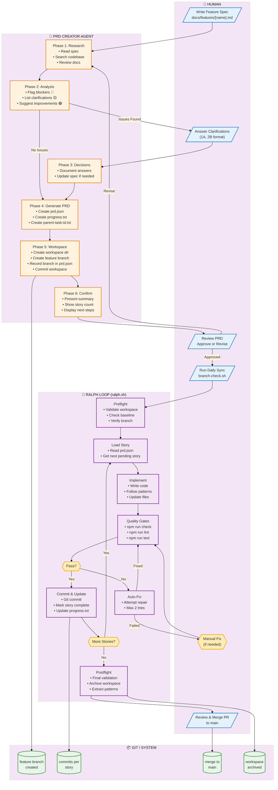
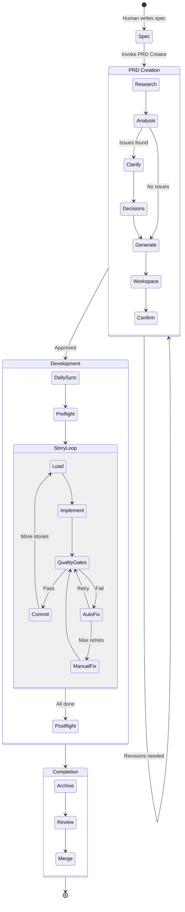

# Ralph Loop - Complete Workflow

## Swimlane Diagram (Mermaid)



## Simplified Linear View

```mermaid
graph LR
    A["📝 Spec"] --> B["🤖 PRD Creator"]
    B --> C["📋 PRD + Workspace"]
    C --> D["🔄 Daily Sync"]
    D --> E["⚙️ Ralph Loop"]
    E --> F["✅ Stories Complete"]
    F --> G["🔀 Merge to Main"]
    G --> H["📦 Archive"]

    style A fill:#e3f2fd
    style B fill:#fff3e0
    style C fill:#fff3e0
    style D fill:#e8f5e9
    style E fill:#f3e5f5
    style F fill:#f3e5f5
    style G fill:#e8f5e9
    style H fill:#e8f5e9
```



## Detailed Phase Breakdown

### Phase 1: Spec Creation (Human)
```
docs/features/
└── my-feature.md    ← Human writes this
    ├── Problem Statement
    ├── Proposed Solution
    ├── User Stories (rough)
    ├── Technical Considerations
    └── Non-Goals
```

### Phase 2: PRD Creation (Agent)
```
agents/ralph/workspaces/{feature}/
├── parent-task-id.txt   ← Feature identifier
├── prd.json             ← Structured stories + metadata
│   ├── feature
│   ├── branch           ← NEW: Tracks expected branch
│   ├── base_branch      ← NEW: What to sync from
│   ├── research
│   └── stories[]
│       ├── id
│       ├── title
│       ├── status: pending|in_progress|completed
│       ├── dependencies
│       └── acceptance_criteria
└── progress.txt         ← Implementation log
```

### Phase 3: Ralph Loop Execution
```
┌─────────────────────────────────────────────────────────────┐
│                     RALPH LOOP                               │
├─────────────────────────────────────────────────────────────┤
│                                                               │
│  ┌─────────┐    ┌─────────┐    ┌─────────┐    ┌─────────┐   │
│  │ Preflight│───▶│ Story   │───▶│ Implement│───▶│ Quality │   │
│  │ Checks  │    │ Load    │    │ Code    │    │ Gates   │   │
│  └─────────┘    └─────────┘    └─────────┘    └────┬────┘   │
│                                                     │        │
│                      ┌──────────────────────────────┤        │
│                      │                              │        │
│                      ▼                              ▼        │
│                 ┌─────────┐                   ┌─────────┐   │
│                 │ Pass ✓  │                   │ Fail ✗  │   │
│                 └────┬────┘                   └────┬────┘   │
│                      │                              │        │
│                      ▼                              ▼        │
│                 ┌─────────┐                   ┌─────────┐   │
│                 │ Commit  │                   │ Auto-Fix│   │
│                 │ Story   │                   │ (2 max) │   │
│                 └────┬────┘                   └────┬────┘   │
│                      │                              │        │
│                      ▼                              │        │
│                 ┌─────────┐                         │        │
│                 │ More    │◀────────────────────────┘        │
│                 │ Stories?│                                  │
│                 └────┬────┘                                  │
│                      │                                       │
│           ┌─────────┴─────────┐                             │
│           ▼                   ▼                             │
│      ┌─────────┐        ┌─────────┐                         │
│      │ Yes     │        │ No      │                         │
│      │ (loop)  │        │ (done)  │                         │
│      └─────────┘        └────┬────┘                         │
│                              │                               │
│                              ▼                               │
│                        ┌─────────┐                           │
│                        │Postflight│                          │
│                        │ Archive │                           │
│                        └─────────┘                           │
│                                                               │
└─────────────────────────────────────────────────────────────┘
```

### Phase 4: Completion
```
┌─────────────────────────────────────────────────────────────┐
│  Feature Complete!                                           │
├─────────────────────────────────────────────────────────────┤
│                                                               │
│  📦 Workspace archived to:                                    │
│     agents/ralph/archive/{timestamp}-{feature}/              │
│                                                               │
│  🌿 Feature branch ready:                                     │
│     feature/{parent-task-id}                                 │
│                                                               │
│  📊 Patterns extracted to:                                    │
│     agents/ralph/patterns/                                   │
│                                                               │
│  ✅ Human reviews and merges PR                               │
│                                                               │
└─────────────────────────────────────────────────────────────┘
```

## State Transitions



## Key Integration Points

| Step | Input | Output | Actor |
|------|-------|--------|-------|
| Spec Creation | Idea/requirement | `docs/features/x.md` | Human |
| PRD Research | Spec file | Internal notes | Agent |
| PRD Clarify | Questions | Decisions | Human ↔ Agent |
| PRD Generate | Decisions | `prd.json`, `progress.txt` | Agent |
| Workspace Setup | PRD files | Feature branch + workspace | Agent |
| Daily Sync | Branch state | Merged branch | Human (script) |
| Story Implementation | Story from PRD | Code changes | Agent |
| Quality Gates | Code | Pass/Fail | System |
| Commit | Passing code | Git commit | Agent |
| Postflight | All stories done | Archived workspace | Agent |
| PR Review | Feature branch | Merged to main | Human |

## File Flow

```
docs/features/my-feature.md
        │
        ▼ (PRD Creator reads)
agents/ralph/workspaces/my-feature/
├── parent-task-id.txt
├── prd.json
└── progress.txt
        │
        ▼ (Ralph Loop reads/updates)
src/
├── lib/...  (code changes)
├── routes/... (code changes)
└── ...
        │
        ▼ (On completion)
agents/ralph/archive/{timestamp}-my-feature/
├── parent-task-id.txt
├── prd.json
├── progress.txt
└── COMPLETION_SUMMARY.md
```
